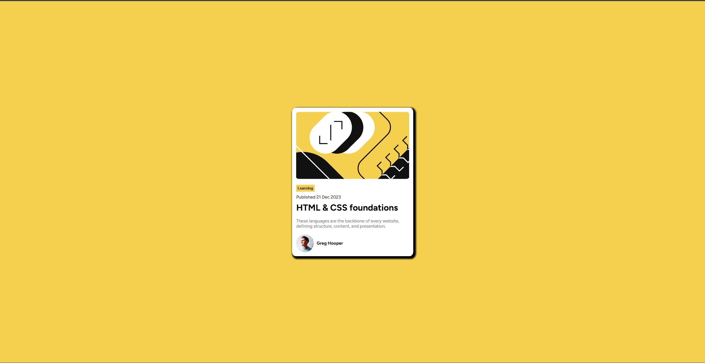

# Frontend Mentor - Blog card

This is a solution to the [Blog card component challenge on Frontend Mentor]. Frontend Mentor challenges help you improve your coding skills by building realistic projects. 

## Table of contents

- [Overview](#overview)
  - [Screenshot](#screenshot)
  - [Links](#links)
  - [Built with](#built-with)
  - [What I learned](#what-i-learned)
## Overview

### Screenshot

### Links

- Live Site URL: [https://rottenunusual.github.io/Frontend-Mentor-Blog-preview-card/]

### Built with

- Semantic HTML5 markup
- CSS custom properties
- Flexbox

### What I learned

I learned how to use css clamp feature and i am getting more comfortable with flexbox

